Übung 01
========

Aufgabe 1
----------
__Musikaufnahme:__ 
<audio controls>
  <source src="assets/Aufgabe_1/a1_sounds/music.wav" type="audio/wav">
</audio>
Abtastfrequenz der Musik: 44100.  
Grund: Etwas mehr als das doppelte der vom menschlichen Ohr wahrnehmbaren Frequenz (0 - 20kHz) um dem Abtasttheorem zu entsprechen, d.h. damit das ursprüngliche Signal wieder exakt rekonstruiert werden kann.

__Sprachaufnahme:__
<audio controls>
  <source src="assets/Aufgabe_1/a1_sounds/voice.wav" type="audio/wav">
</audio>

Aufgabe 2.1
-----------
__Sine_hi03.wav:__ 
<audio controls>
  <source src="assets/Aufgabe_1/a1_sounds/sine_hi03.wav" type="audio/wav">
</audio>
Ungefähr eine Periode: -6270 15137 -15137 6270  
Wir ziehen ein Sample ab da Beginn und Ende nicht ganz korrekt sind => 3 Samples.
16000 Samples pro Sekunde / 3 Samples pro Periode = 5333,33 Perioden pro Sekunde
Demnanch hat Sine_hi03.wav eine geschätzte Frequenz von ca. 5333,33 Hz.
Spektralanalyse mit GRAM zeigt 6000 Hz.

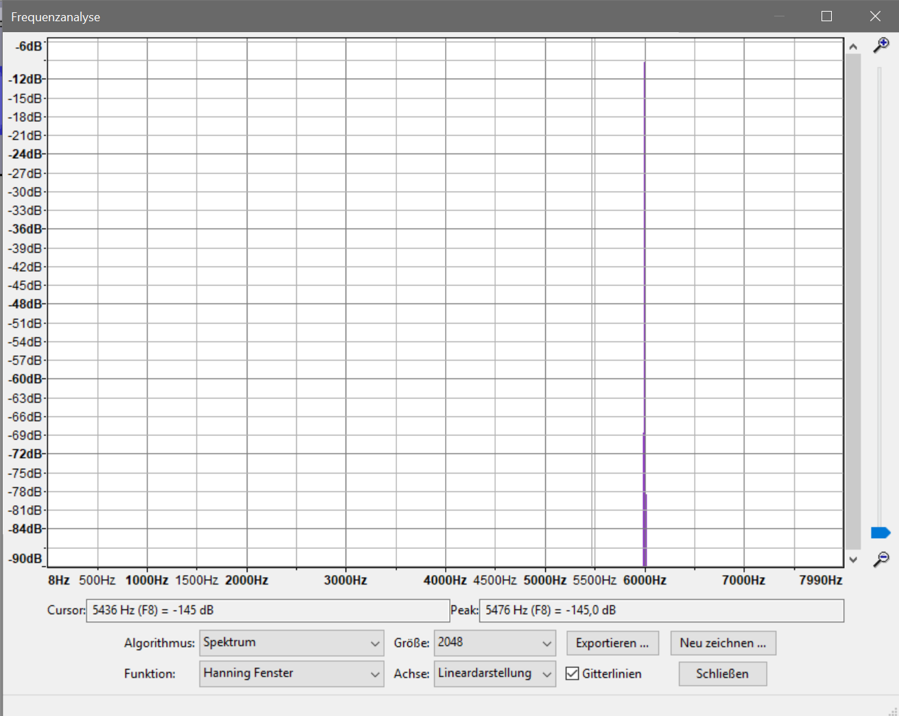

__Sine_lo03.wav:__
<audio controls>
  <source src="assets/Aufgabe_1/a1_sounds/sine_lo03.wav" type="audio/wav">
</audio>
Wir nehmen 2 Perioden um Fehler zu minimieren.  
[3196 16069 9102 -9102 -16069 -3196] und [13623 13623 -3196 -16069 -9102]  
11 Samples / 2 Perioden = 5.5 Samples / Periode.
16000 Samples pro Sekunde / 5.5 Samples pro Periode => 2909,09 Perioden pro Sekunde
Demnanch hat Sine_lo03.wav eine geschätzte Frequenz von ca. 2909,09 Hz.
Spektralanalyse mit GRAM zeigt 3000 Hz.

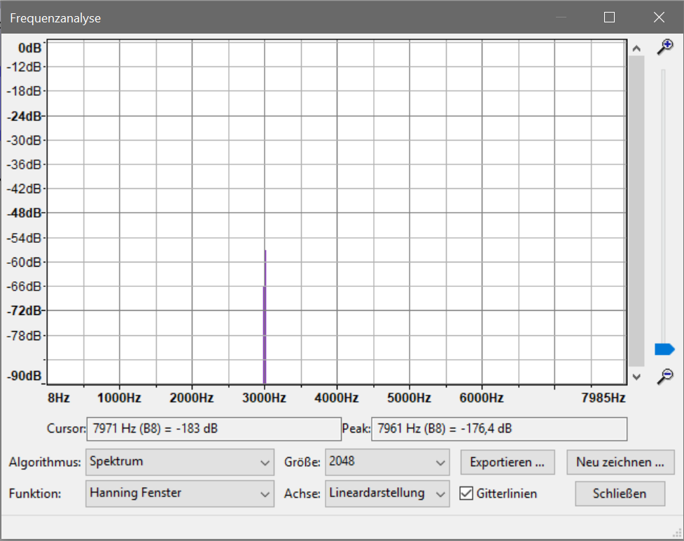
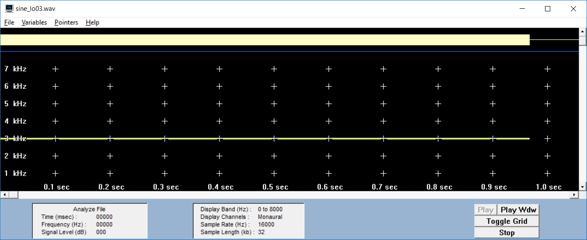

Aufgabe 2.2
-----------
Das Abtasttheorem besagt, dass ein Signal mit mindestens der doppelten Frequenz der maximalen Signalfrequenz abgetastet werden muss, also das Abtastfrequenz fa >= 2 * fmax gilt. Der theoretische Grenzfall ist, wenn mit genau dieser doppelten Frequenz abgetastet wird. In diesem Fall wird die höchste Frequenz pro Periode je 2x abgetastet.

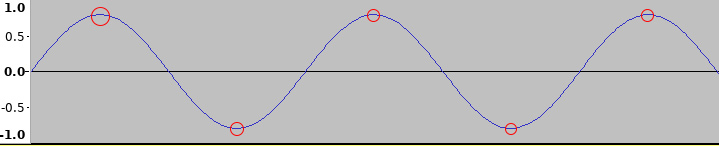

Aufgabe 2.3
-----------
Das Signal wird um die hohen nicht abtastbaren Frequenzen beschnitten mittels eines Tiefpassfilters.

Aufgabe 2.4
-----------
Bei sine_hi03.wav erscheint die Frequenz 2000hz.
Bei sine_lo03.wav weiterhin die Frequenz 3000hz da diese auch bei 8khz noch im abtastbaren Bereichliegt. (Bei 8khz Abtastrate nur noch bis zu 4khz Signalfrequenz darstellbar)
Würde geeignet Bandbegrenz werden, dann wäre die Frequenz für sine_hi03.wav nach dem Downsampling nicht mehr vorhanden, da alle Frequenzen über 4khz vor dem Downsampling abgeschnitten werden würden.
Die niedrigere Frequenz sine_lo03.wav würde weiterhin hörbar sein, da sie nicht beschnitten wird.

__sine_hi downsampled__
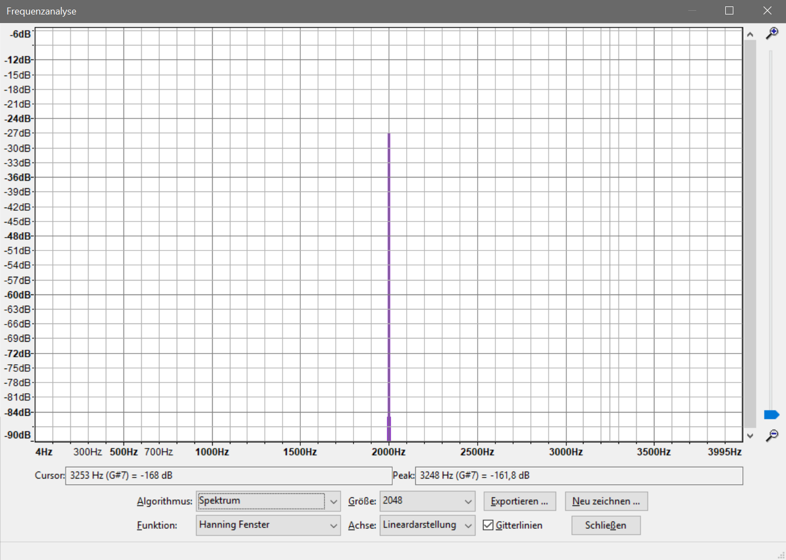
  
__sine_lo downsampled__
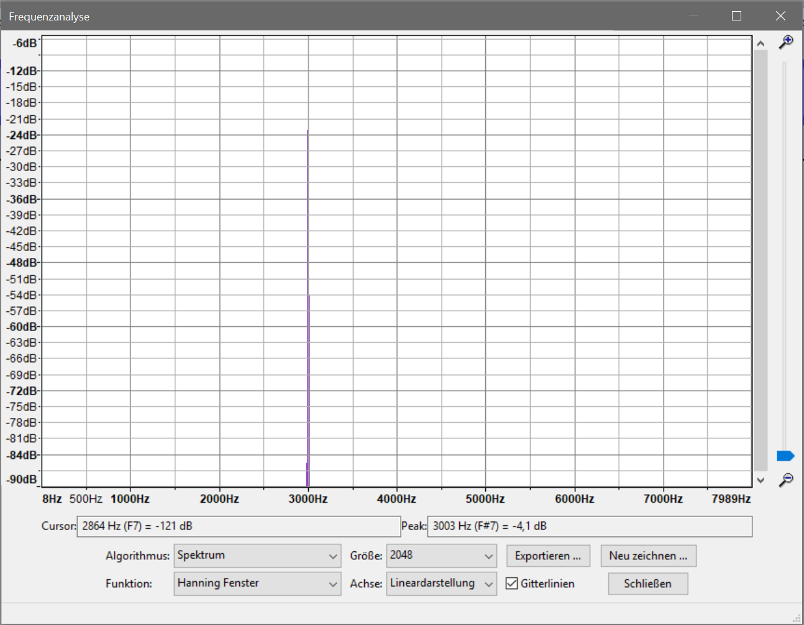

Aufgabe 3.1
-----------
Bei 8bit: 255 mögliche Amplitudenwerte (-128 bis 127)  
Bei 16bit: 65535 mögliche Amplitudenwerte (-32768 bis 32767)

Aufgabe 3.2 
-----------
s. Quelltext

Aufgabe 3.3
-----------
Das Sprachsignal bleibt bis ca. 10 Bit Reduktion noch verständlich. Das Quantisierungsgeräusch macht sich in Form von wahrgenommenen Störgeräuschen in Form von Rauschen bemerkbar.

__Sprachaufnahme original:__
<audio controls>
  <source src="assets/Aufgabe_1/a1_sounds/voice.wav" type="audio/wav">
</audio>

__Sprachaufnahme 2bit Reduzierung:__
<audio controls>
  <source src="assets/Aufgabe_1/a_3_03/bitreduced_2.wav" type="audio/wav">
</audio>
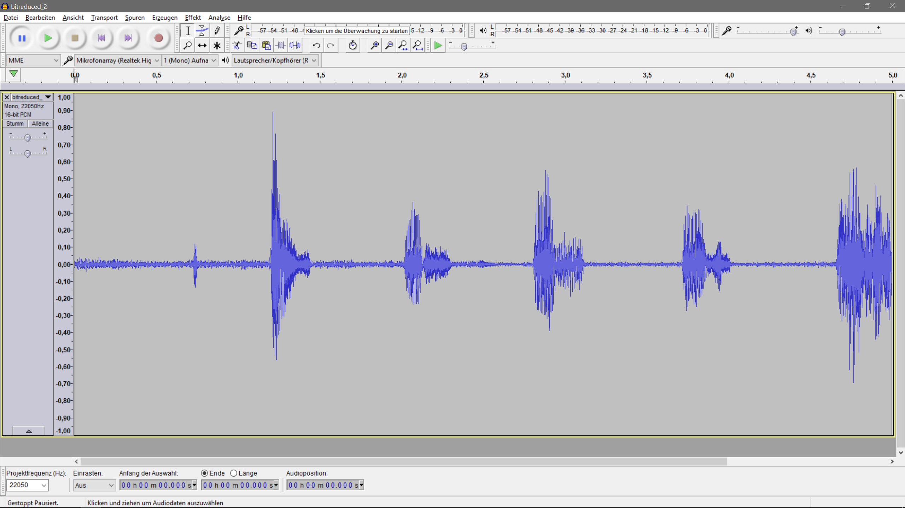
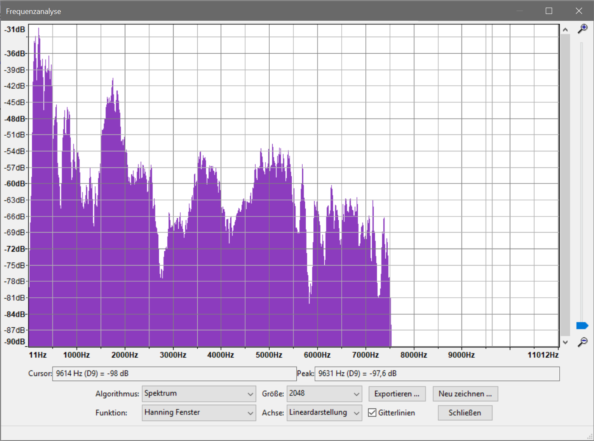

__Sprachaufnahme 4bit Reduzierung:__
<audio controls>
  <source src="assets/Aufgabe_1/a_3_03/bitreduced_4.wav" type="audio/wav">
</audio>
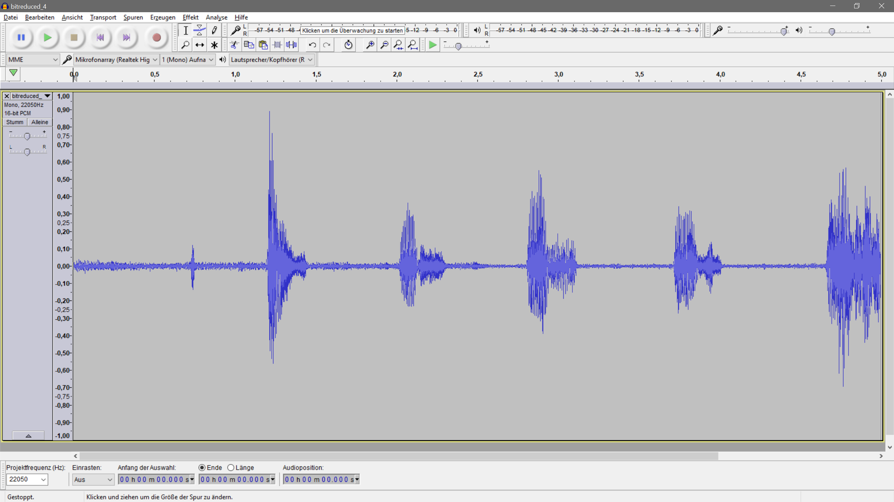
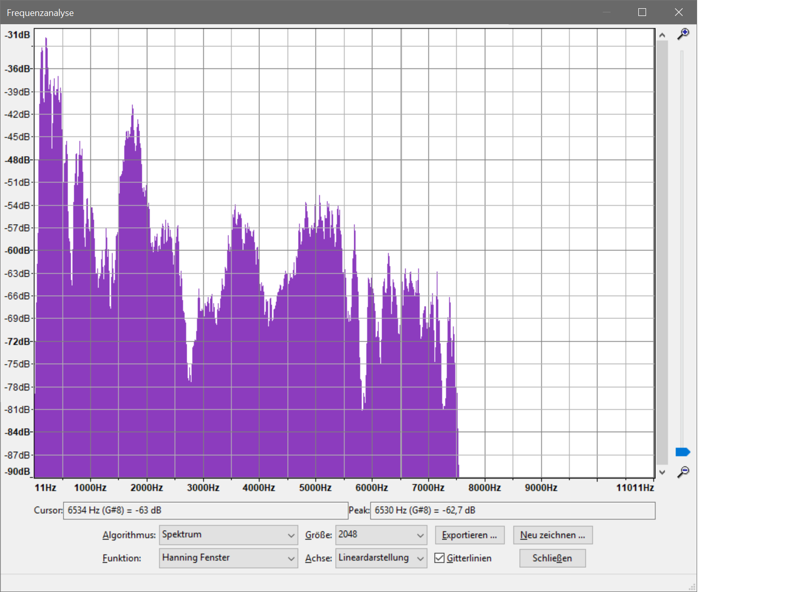

__Sprachaufnahme 8bit Reduzierung:__
<audio controls>
  <source src="assets/Aufgabe_1/a_3_03/bitreduced_8.wav" type="audio/wav">
</audio>
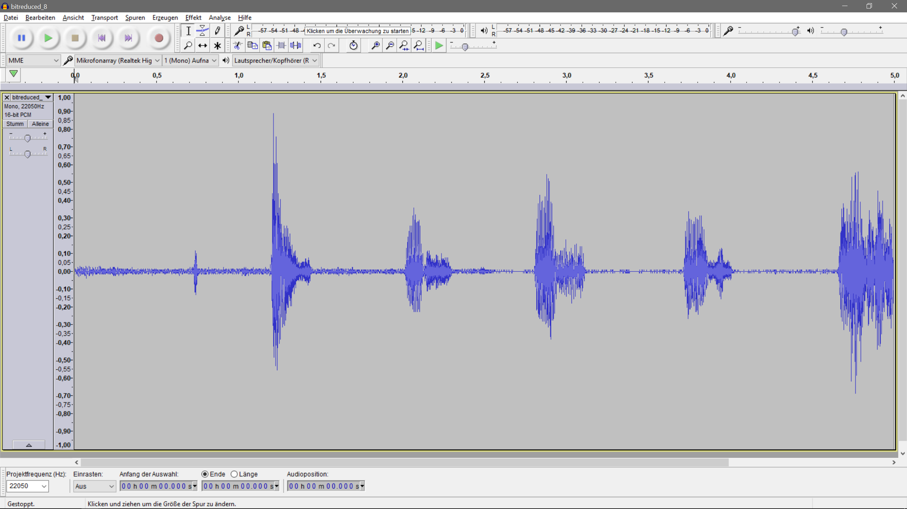
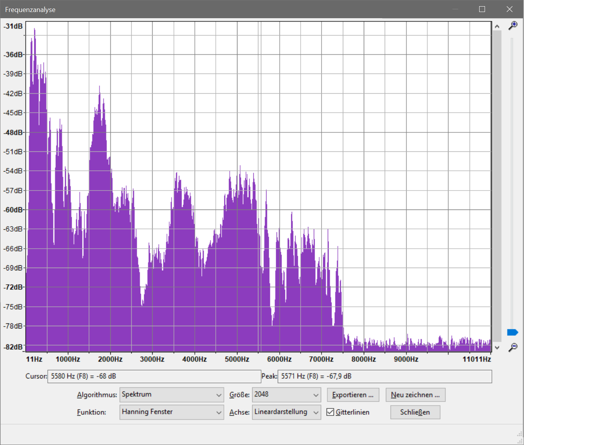

__Sprachaufnahme 14bit Reduzierung:__
<audio controls>
  <source src="assets/Aufgabe_1/a_3_03/bitreduced_14.wav" type="audio/wav">
</audio>
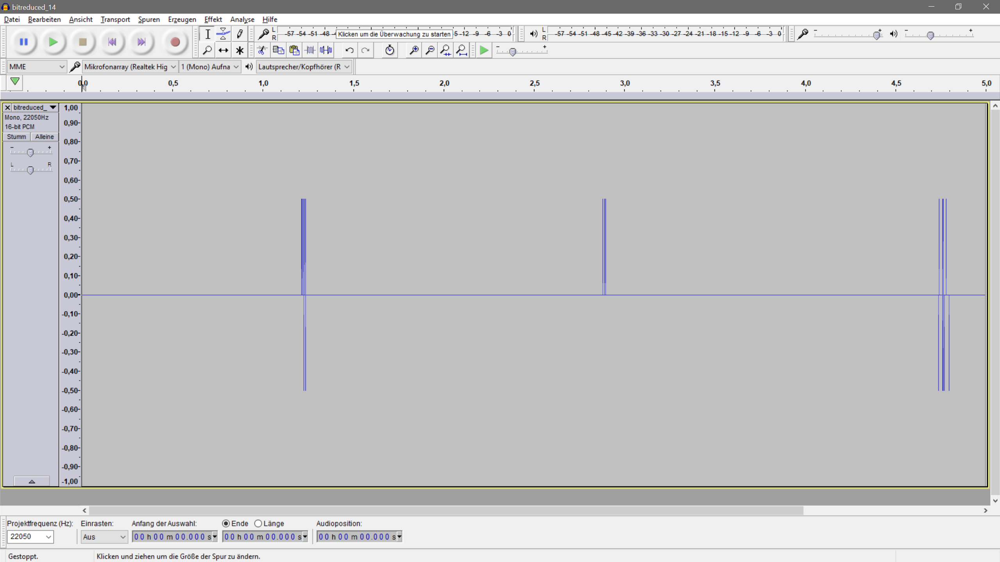
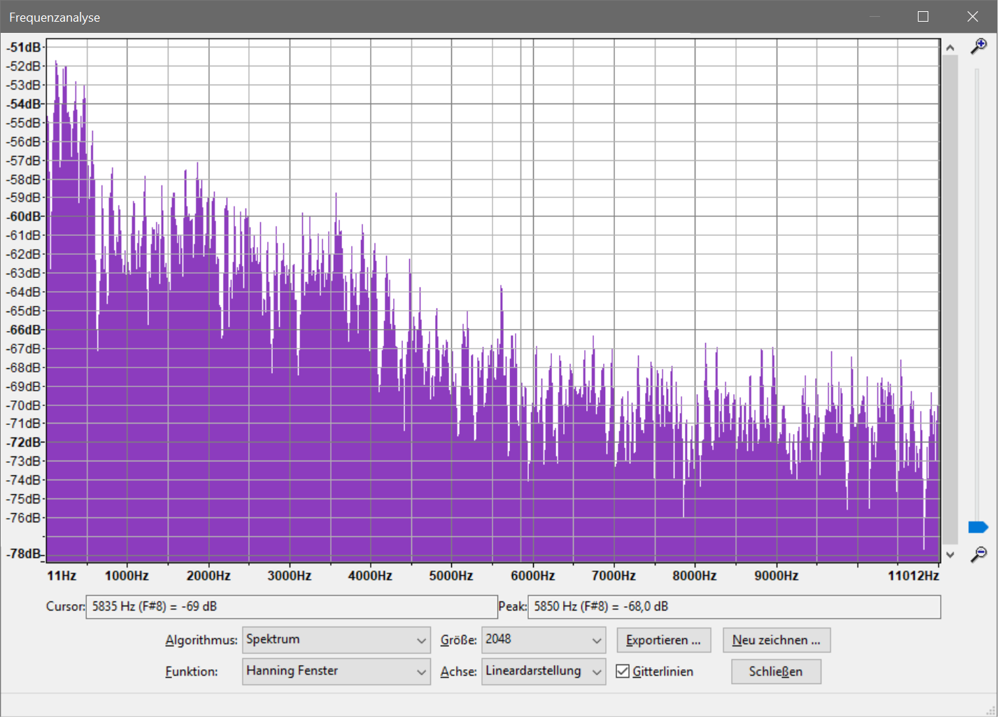

Aufgabe 3.4
-----------
Das Quantisierungsrauschen wird lauter je weiter das Signal in seinem Dynamikumfang beschnitten wird. 
Die Lautstärke des Rauschens korelliert mit der Lautstärke des beschnittenen Signals, d.h. an lauten Stellen ist das Rauschen lauter, da mehr Dynamik abgeschnitten wird, bei leisen Stellen leiser, da weniger Dynamik abgeschnitten wird.

__Differenz 2bit Reduzierung:__
<audio controls>
  <source src="assets/Aufgabe_1/a_3_04/diff_bitreduced_2.wav" type="audio/wav">
</audio>

__Differenz 4bit Reduzierung:__
<audio controls>
  <source src="assets/Aufgabe_1/a_3_04/diff_bitreduced_4.wav" type="audio/wav">
</audio>
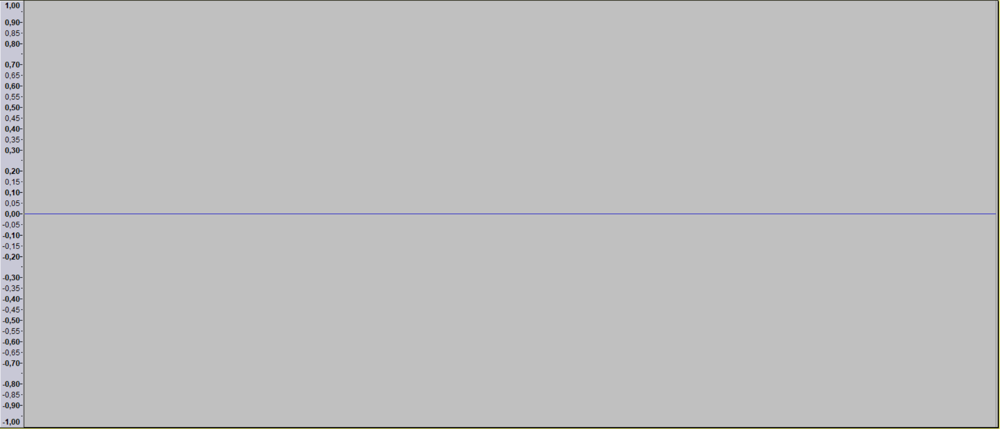

__Differenz 8bit Reduzierung:__
<audio controls>
  <source src="assets/Aufgabe_1/a_3_04/diff_bitreduced_8.wav" type="audio/wav">
</audio>
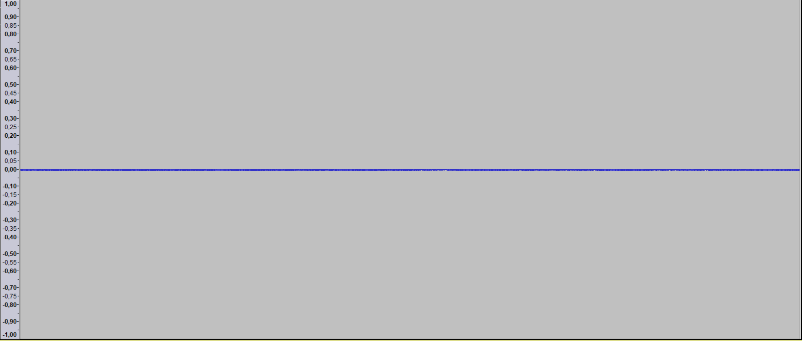

__Differenz 10bit Reduzierung:__
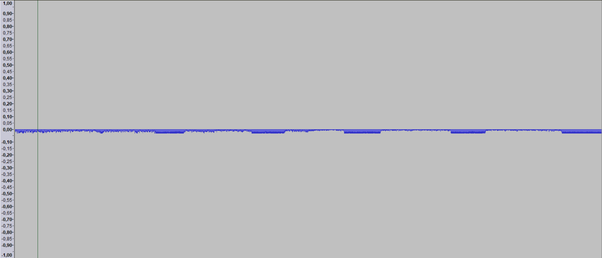

__Differenz 14bit Reduzierung:__
<audio controls>
  <source src="assets/Aufgabe_1/a_3_04/diff_bitreduced_14.wav" type="audio/wav">
</audio>
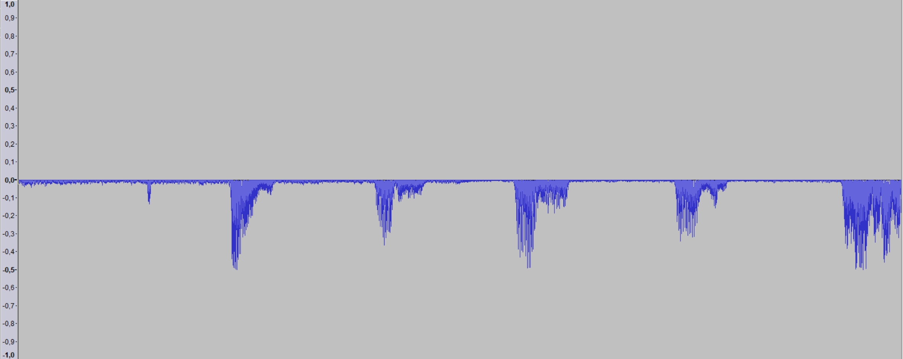

