Übung 02
========

Aufgabe 1
---------
__Detailbild__  

  
__Flächenbild__  
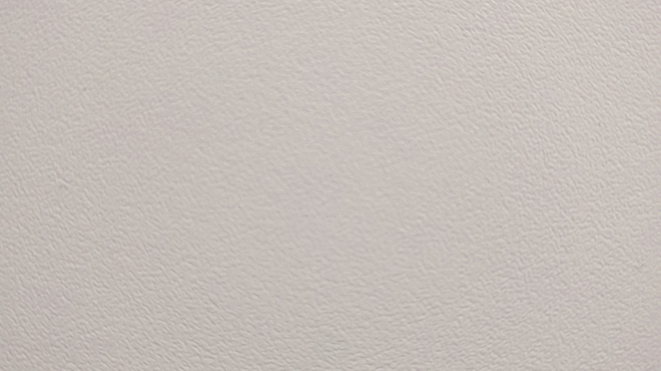

__Headerangaben__  
Filesize: Höhe * Breite * (Anzahl Komponenten) + Headersize (54 Byte)  
BitsperPixel: Anzahl der Bits zur Pixeldarstellung (8 Bit pro Farbkanal bei RGB)  
Höhe: Höhe des Bildes in Pixeln  
Breite: Breite des Bildes in Pixeln  

__Grating H1__  
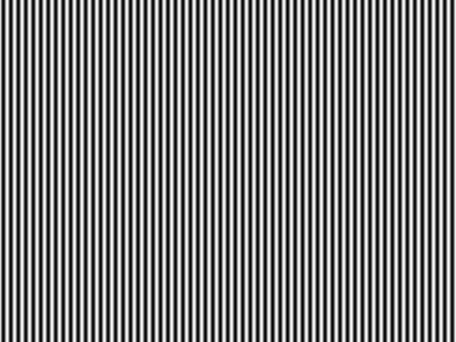

__Grating V1__  
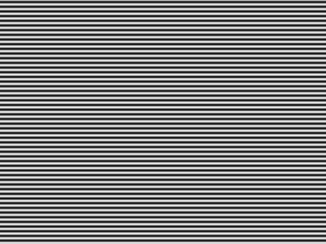

Aufgabe 2.1
-----------
__Grating V1__  
Eine Periode: 
```
0 0 0  
28 28 28  
101 101 101  
185 185 185  
243 243 243  
249 249 249  
200 200 200  
118 118 118  
40 40 40  
1 1 1  
```
Vertikal: Periodenlänge = 11 Samples

__Grating H1__  
Eine Periode:
```
1 1 1  
34 34 34  
99 99 99  
173 173 173  
232 232 232  
254 254 254  
232 232 232  
173 173 173  
99 99 99  
34 34 34  
1 1 1  
```
Horizontal: Periodenlänge = 11 Samples

Aufgabe 2.2
-----------
Periodendauer >= 2Pixel  
__Zeichung:__
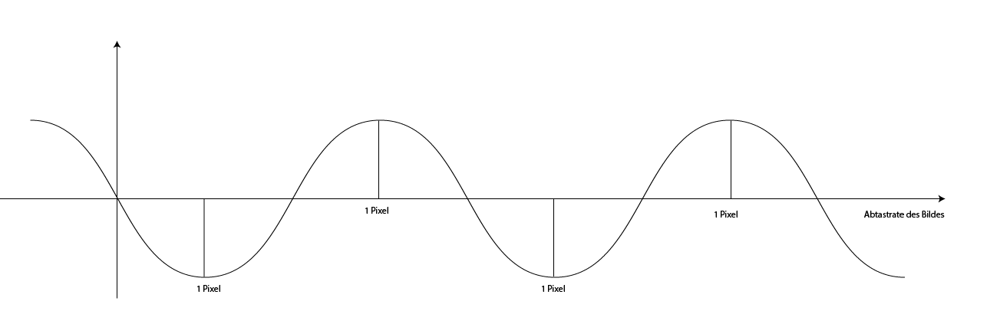

Aufgabe 2.3 
-----------
Der Grauwert errechnet sich aus dem Mittelwert über den Rot, Grün und Blauwert. Eigentlich müssten die 3 Werte entsprechend der Empfindlichkeit des Auges noch gewichtet werden. Unter Java passiert dies automatisch, da die Helligkeitswerte pro Farbkanal bereits gewichtet sind.
  
__Graustufenbild__  
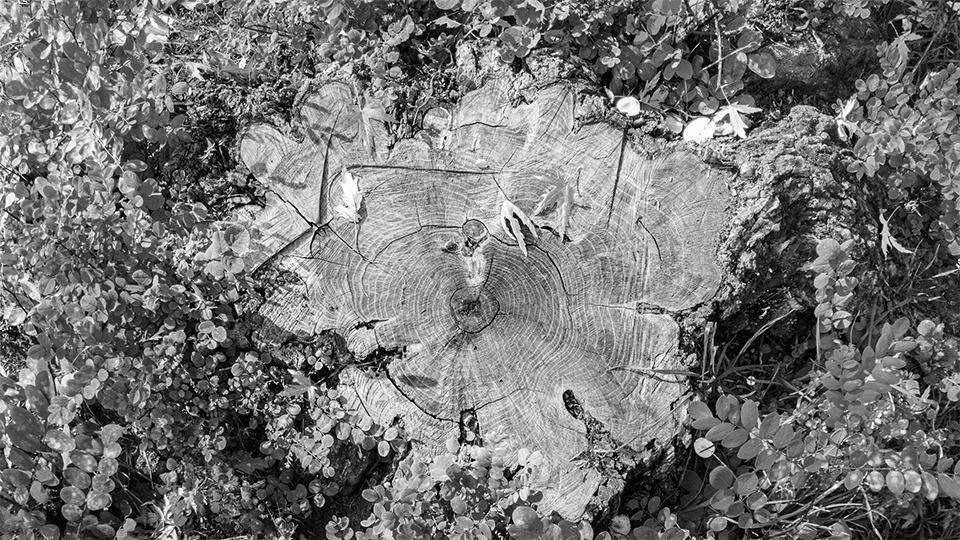

Aufgabe 2.4 
-----------
Aliasing kann entstehen wenn das Bild eine höhere Auflösung hat als die Kamera. In diesem Fall können Details verloren gehen oder von der Kamera falsch aufgenommen werden. Es kann z.B. ein Moiré-Effekt entstehen.
Bei Videos tritt der Wagon-Wheel-Effekt auf, da das Objekt vor der Linse sich schneller bewegt als mit der Kamera neue Bilder aufgenommen werden. 

Aufgabe 2.5
-----------
Das horizontale Downsampling ergibt nur Sinn bei dem Bild grating_H1.bmp, da das dargestellte Muster nicht symmetrisch zur x-achse verläuft. Bei der anderen Datei hätte ein Downsampling keine visuellen Auswirkungen.
Bei den eigenen Bildern entsteht eine Verschlechterung bereits ab einer downgesampleten Zeile. Der auftretende Effekt tritt in Form von Verpixelung, allerdings nur entlang der schwarzen Linien auf.
  
__downsampled.bmp__  
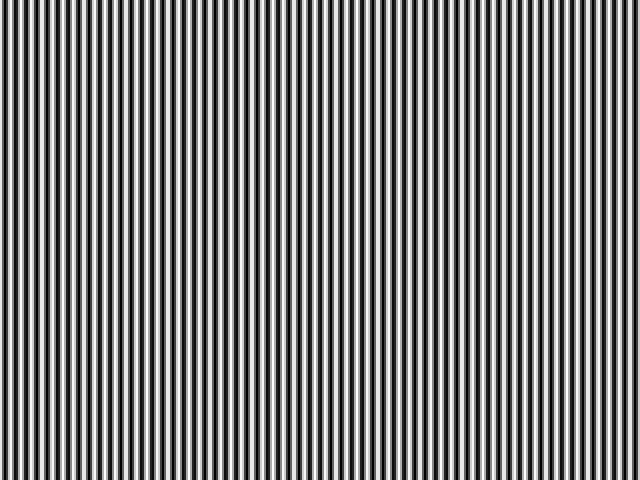

Aufgabe 3.2 
-----------
__Details:__  
Ab 4 Bit Reduktion fällt eine Verdunklung des Bildes auf. Ab 5 bit Reduktion wird eine merkbar größere Differenz zwischen den Farben sichtbar

__Detail 4bit Reduzierung:__  
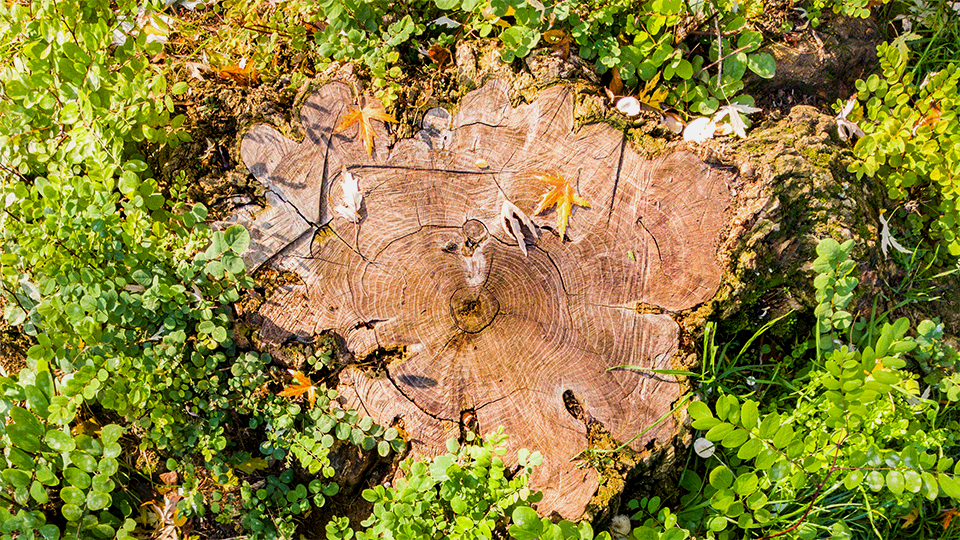

__Detail 5bit Reduzierung:__  
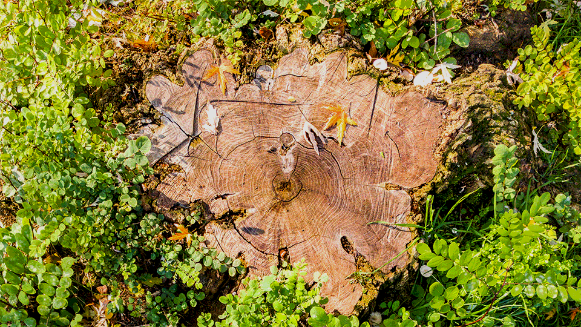

__Detail 6bit Reduzierung:__  
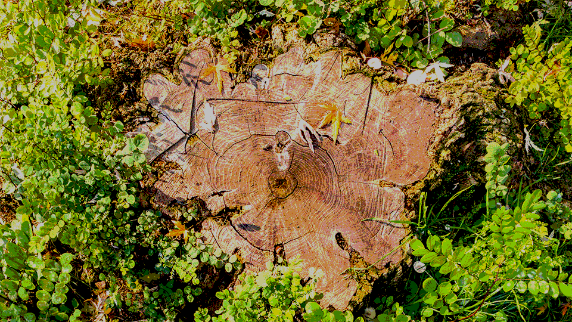

__Flächen:__  
Bei den Flächen fällt ab 4 Bit Reduktion eine deutliche Erhöhung des Kontrastes auf. Unregelmäßgkeiten auf der Fläche treten deutlicher auf. Ab 5 Bit tritt eine deutliche Verfälschung der Farben auf. Die gering vorhanden Rot-Töne im Bild werden extrem verstärkt dargestellt.

__Flächen 4bit Reduzierung:__  
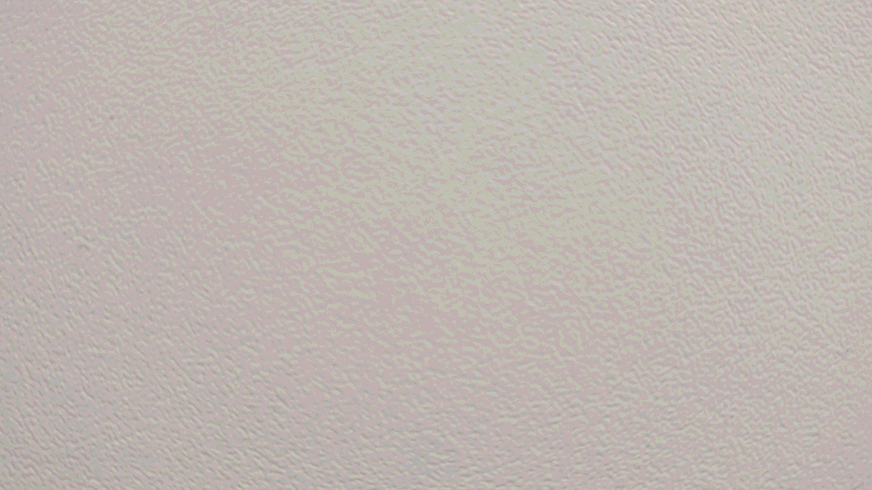

__Flächen 5bit Reduzierung:__  
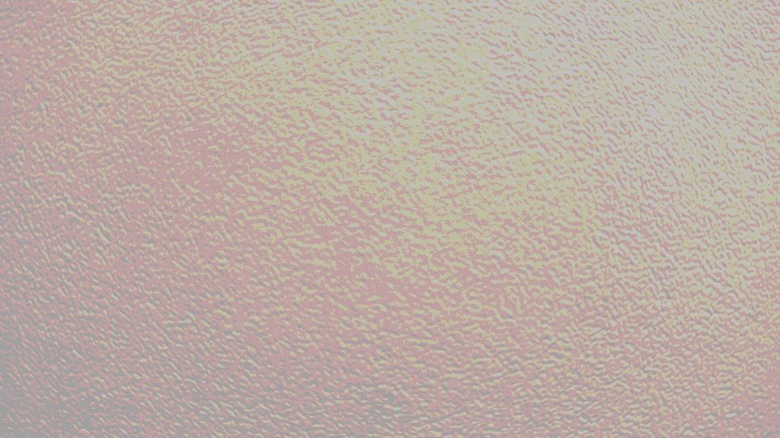

__Flächen 6bit Reduzierung:__  
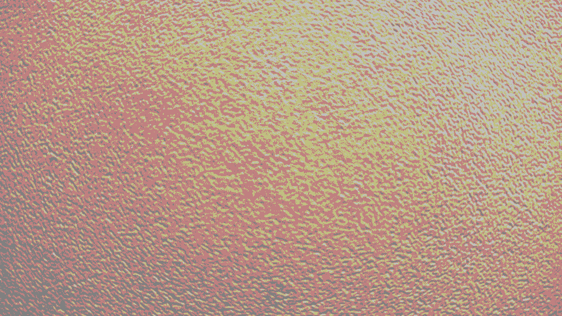

Aufgabe 3.3
-----------
__Differenz Detail 4bit Reduzierung:__  
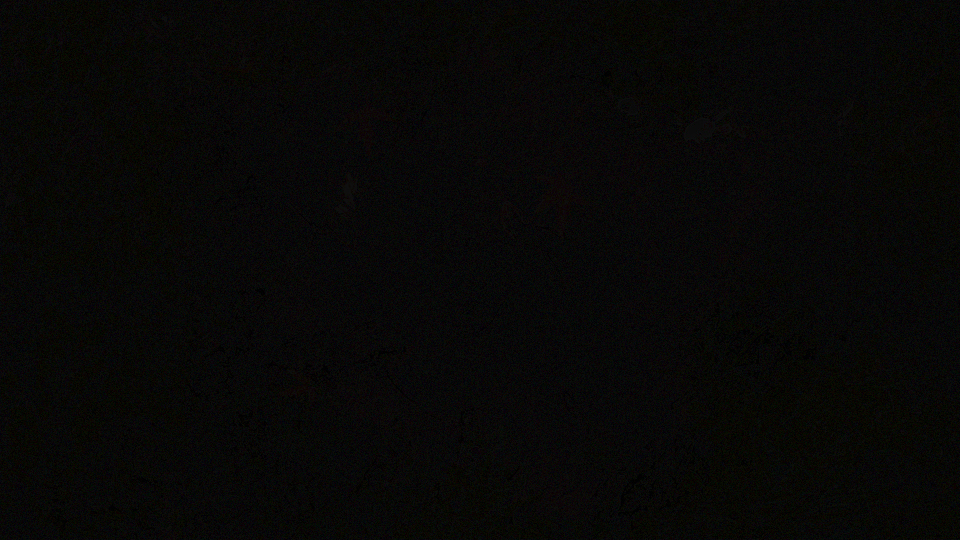

__Differenz Detail 5bit Reduzierung:__  
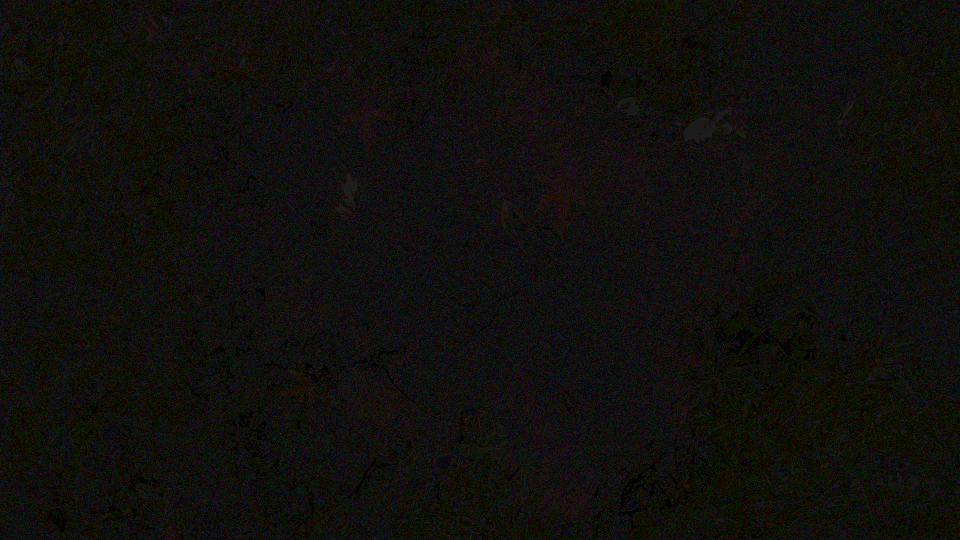

__Differenz Detail 6bit Reduzierung:__  
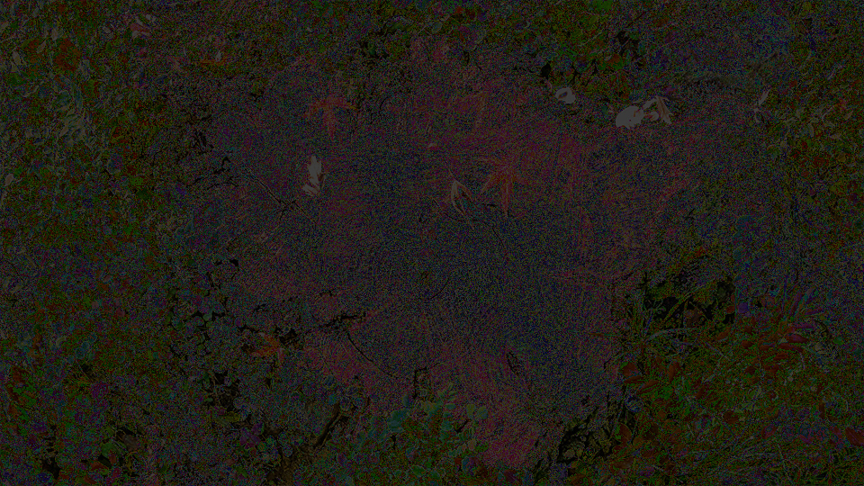

__Differenz Flächen 4bit Reduzierung:__  


__Differenz Flächen 5bit Reduzierung:__  
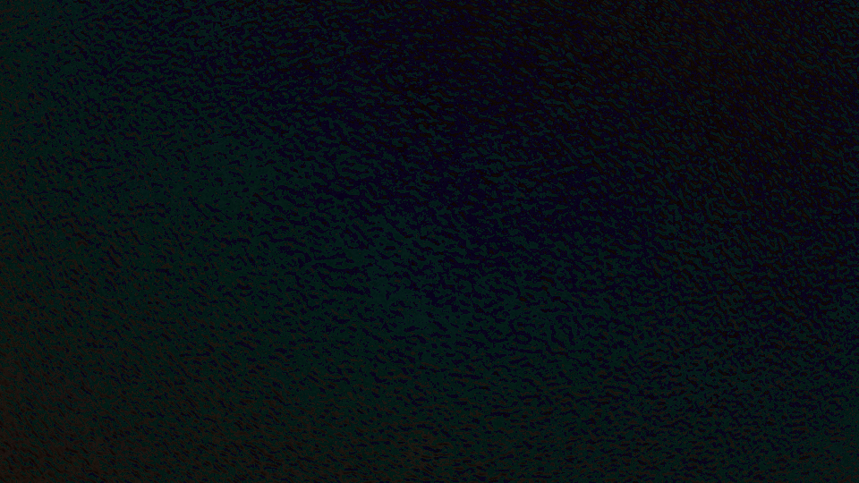

__Differenz Flächen 6bit Reduzierung:__  
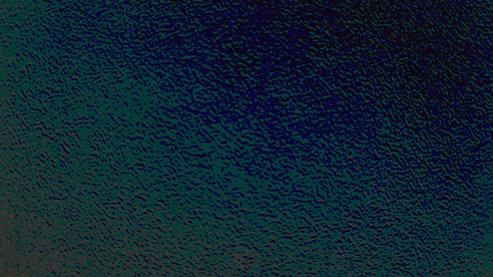
