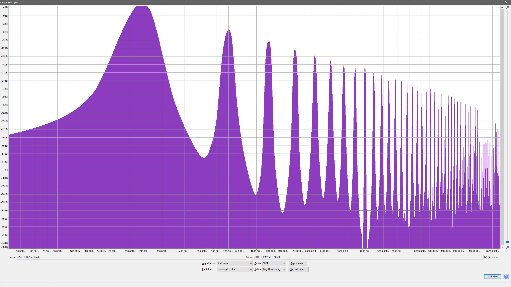

Übung 03
========

Aufgabe 1
---------

__Rechteck-P-Width-0__  

__Wav:__
<audio controls>
  <source src="assets/Aufgabe_3/audiofiles/1_pls_pWidth0.wav" type="audio/wav">
</audio>

Grundfrequenz: 234Hz 4,4dB  
0dB 100%
1. Oberton: 702 Hz -5,1dB   
-9,5dB 33,5%
2. Oberton: 1173 Hz -9dB    
-13,4dB 21,4%
3. Oberton: 1637 Hz -12,9dB  
-17,3dB 13,6%
  
__Rechteck-P-Width-0.5__  

__Wav:__
<audio controls>
  <source src="assets/Aufgabe_3/audiofiles/1_pls_pWidth05.wav" type="audio/wav">
</audio>

Grundfrequenz: 234 Hz 1,4dB  
0dB 100%
1. Oberton: 468 Hz -20dB  
-21,4dB 8,5%
2. Oberton: 702 Hz -8,1dB  
-9,5dB 33,5%
3. Oberton: 1173 Hz -12,6dB lokales Minimum bei ca. 1020 Hz  
-14dB 20%
  
__Rechteck-P-Width-0.98__  

__Wav:__
<audio controls>
  <source src="assets/Aufgabe_3/audiofiles/1_pls_pWidth098.wav" type="audio/wav">
</audio>

Grundfrequenz: 234 Hz -27.0dB  
0dB 100%
1. Oberton: 468 Hz -27.4 dB  
-0,4dB 95,5%
2. Oberton 702 Hz -27.0 dB  
0dB 100%
3. Oberton 930 Hz -26,9 dB  
0,1dB 101.2%

__Saw__  

__Wav:__
<audio controls>
  <source src="assets/Aufgabe_3/audiofiles/1_saw_pWidth0.wav" type="audio/wav">
</audio>

Grundfrequenz: 234 Hz -1,6dB  
0dB 100%
1. Oberton: 468 Hz -8,0 dB  
-6,4dB 47,9%
2. Oberton 702 Hz -11.1 dB  
-9,5dB 33,5%
3. Oberton 930 Hz -13,5 dB  
-11,9dB 25,4%

__Dreieck__  

__Wav:__
<audio controls>
  <source src="assets/Aufgabe_3/audiofiles/1_tri_pWidth0.wav" type="audio/wav">
</audio>

Grundfrequenz: 234 Hz 0,5 dB  
0dB 100%
1. Oberton: 702 Hz -18,6 dB  
-19,1dB 11,1%
2. Oberton: 1173 Hz -27,3 dB  
-27,8dB 4,1%
3. Oberton:1673 Hz -33,7 dB  
-34,2dB 1,9%

Aufgabe 2
---------

__Fine 0.01 Spektrum__  

__Fine 0.01 Hüllkurve__  

__Wav:__
<audio controls>
  <source src="assets/Aufgabe_3/audiofiles/2_a_fine01.wav" type="audio/wav">
</audio>

Differenzfrequenz: ca. 0,0303 Hz (ergibt sich aus der Periodendauer von ca. 33 Sekunden)
Mittenfrequenz:
Da der Fine Regler das Signal jeweils um cents moduliert, kann die Mittenfrequenz berechnet werden.
Die Grundfrequenz beträgt 234 Hz.
Der Fine-Regler wurde auf 0.01 gestellt, daher wurder die Frequenz um einen Cent angehoben.
Das entspricht bei 234 Hz einer Erhöhung der Frequenz um  den Faktor ((12.Wurzel aus 2) / 100)
Die Frequenz des zweiten Kanals beträgt also ca. 236,479 Hz.
Die Mittenfrequenz bestimmen wir aus der Wurzel des Produktes der beiden Frequenzen:
Die Mittenfrequenz beträgt 235,236 Hz

__Pitch 2 Spektrum__  

__Pitch 2 Hüllkurve__  

__Wav:__
<audio controls>
  <source src="assets/Aufgabe_3/audiofiles/2_b_pitch2.wav" type="audio/wav">
</audio>

Die Perioden dauer beträgt ca. 35ms. 
Die Differenzfrequenz beträgt also ca. 28,571 Hz
Mittenfrequenz:
Da der Pitch-Regler um 2 angehoben wurde, wurde das Signal um 2 Halbtöne erhöht. Das entspricht 200 Cents.
Wir können also die Siganlfrequenz des 2. Kanals wie folgt berechnen: (((12. Wurzel aus 2)) * Grundfrequenz) = Pitch_1
(((12. Wurzel aus 2)) * Pitch_1) = Pitch_2
Die Frequenz beträgt also: 262,656 Hz
Die Mittenfrequenz beträgt also: sqrt(234*262,656) = 247.914 Hz

Aufgabe 3
---------
Der erstellte Klang ähnelt einem Holzblasinstrument aufgrund des langsamen Attacks und des ebenfalls länger andauerndem release.

Der Oszillator ist wie folgt aufgebaut:
Der Input ist ein Pitch-Gate welches in einen ADSR-Envelope-Filter läuft mit folgenden Einstellungen:
Attack 58
Decay 32
Sustain 0.74
Release 49
Velocity 0
Scaling -1

Anschließend wird das Signal in 2 Triangle-Oszillatoren geschickt die in einer Mixing-Bay zusammenlaufen und in den Mix-Out gehen.

__Klang Spektrum__  

__Klang Hüllkurve__  

__Hörprobe:__
<audio controls>
  <source src="assets/Aufgabe_3/audiofiles/aufgabe_3.wav" type="audio/wav">
</audio>

<a href="assets/Aufgabe_3/ub03.ens" title="ImageName">
Ensemble-Datei
</a>