Übung 04
========

Aufgabe 1
---------

## a) 
Das Auge nimmt Helligkeit und Farbe ebenfalls getrennt auf. Stäbchen nehmen nur die Helligkeitsinformation auf, Zapfen Farben und deren Intensität getrennt.
Die Zapfen eine viel geringere Empfindlichkeit als die Stäbchen, da mehrere Stäbchen ein Signal aufnehmen, welches im Gehirn zusammengeschaltet wird.
Eine Trennung der Daten macht dahingehend Sinn, dass bei einer Kompression eines Schwarz-Weiß-Bildes, nur die Helligkeitswerte gespeichert werden müssen und nicht wie bei RGB alle Farbwerte den selben Wert, also Faktor 3 mehr Daten.

## b)
__Rot__  


__Grün__  
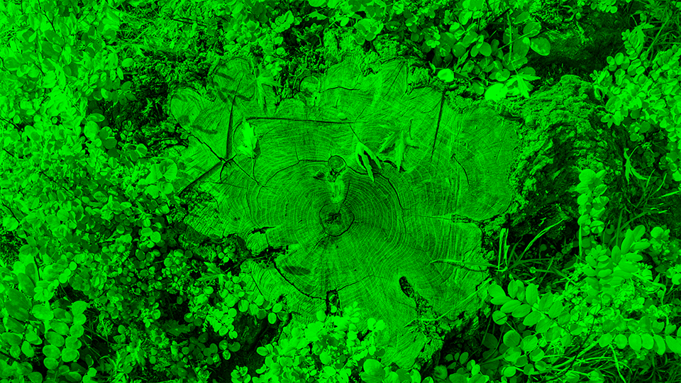

__Blau__  


Auszug aus dem Quelltext für die Berechnung des roten Bildes
```java
        OutputStream outRed = new FileOutputStream("red.bmp");
        for (int y = 0; y < bmpRed.image.getHeight(); y++) {
            for (int x = 0; x < bmpRed.image.getWidth(); x++) {
                PixelColor pOriginal = bmpRed.image.getRgbPixel(x, y);
                pOriginal.b = 0;
                pOriginal.g = 0;
                bmpRed.image.setRgbPixel(x, y, pOriginal);
            }
        }
        try {
            BmpWriter.write_bmp(outRed, bmpRed);
        } finally

        {
            outRed.close();
        }
```

## c)
__Y__  


__Cb__  


__Cr__  


## d)
__Zurückkonvertiert__  


Quelltext für die Methoden zur Umwandlung von YCbCr nach RGB und andersherum

```java
    public static PixelColor rgbToYCbCr(PixelColor p) {
        return new PixelColor(rgbToCr(p), rgbToCb(p), rgbToY(p));
    }

    public static int rgbToY(PixelColor p) {
        return (int) (0.299 * p.r + 0.587 * p.g + 0.114 * p.b);
    }

    public static int rgbToCb(PixelColor p) {
        return (int) (-0.169 * p.r - 0.331 * p.g + 0.5 * p.b) + 128;
    }

    public static int rgbToCr(PixelColor p) {
        return (int) (0.5 * p.r - 0.419 * p.g - 0.081 * p.b) + 128;
    }

    public static PixelColor ycbcrTorgb(PixelColor p) {
        PixelColor rgb = new PixelColor(0, 0, 0);
        int r = (int) (p.r + 1.403 * (p.b - 128));
        int g = (int) (p.r - 0.433 * (p.g - 128) - 0.714 * (p.b - 128));
        int b = (int) (p.r + 1.733 * (p.g - 128));
        rgb.r = r;
        rgb.b = b;
        rgb.g = g;
        return rgb;
    }
```

--------

Aufgabe 2
---------

__Histogramm des monochromen Bildes__  


<a href="assets/Aufgabe_4/textfiles/histogramm.txt" title="Histogramm">
Histogramm als Text-Datei
</a>

Methode zur Erstellung eines Histogramms und die Berechnung der mittleren Helligkeit
```java
 public static double calcAndSaveHistogram(BmpImage img, String filename) throws FileNotFoundException, UnsupportedEncodingException {
        HashMap<Integer, Integer> verteilung = new HashMap<>();
        double avgHelligkeit = 0;
        // initialize hasmap
        for (int i = 0; i < 256; i++) {
            verteilung.put(i, 0);
        }
        for (int x = 0; x < img.image.getWidth(); x++) {
            for (int y = 0; y < img.image.getHeight(); y++) {
                int key = img.image.getRgbPixel(x, y).r;
                avgHelligkeit += key;
                if (!verteilung.containsKey(key)) {
                    verteilung.put(key, 1);
                } else {
                    int count = verteilung.get(key);
                    count++;
                    verteilung.replace(key, count);
                }
            }
        }
        PrintWriter writer = new PrintWriter(filename, "UTF-8");
        // BGR schreiben vertikal 2.1.
        for (HashMap.Entry p : verteilung.entrySet()) {
            writer.println(p.getKey() + "," + p.getValue());
        }
        writer.close();
        return avgHelligkeit;
    }
```
-----

Aufgabe 3
--------

## a) 

Die mittlere Helligkeit des Bildes beträgt 132.46

Die Standardabweichung beträgt: 65,40


## b) Helligkeiten

__Helligkeit: -250__  
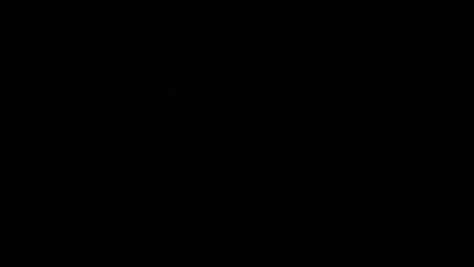

__Helligkeit: -230__  


__Helligkeit: -210__  
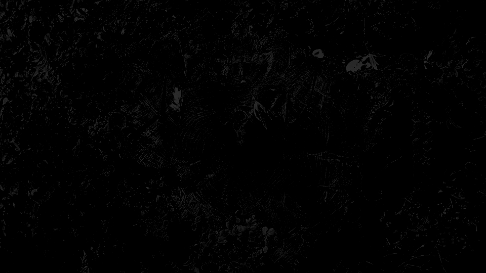

__Helligkeit: -190__  
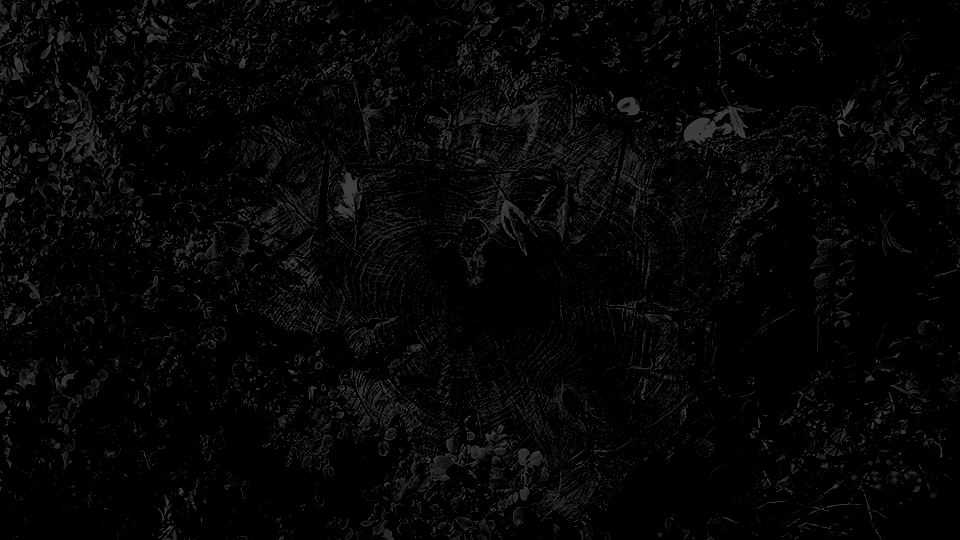

__Helligkeit: -170__  


__Helligkeit: -150__  


__Helligkeit: -130__  


__Helligkeit: -110__  


__Helligkeit: -90__  
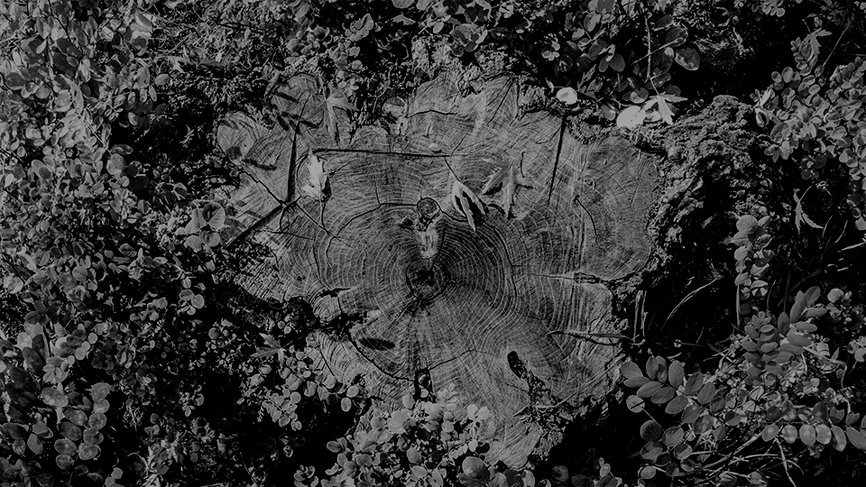

__Helligkeit: -70__  


__Helligkeit: -50__  


__Helligkeit: -30__  
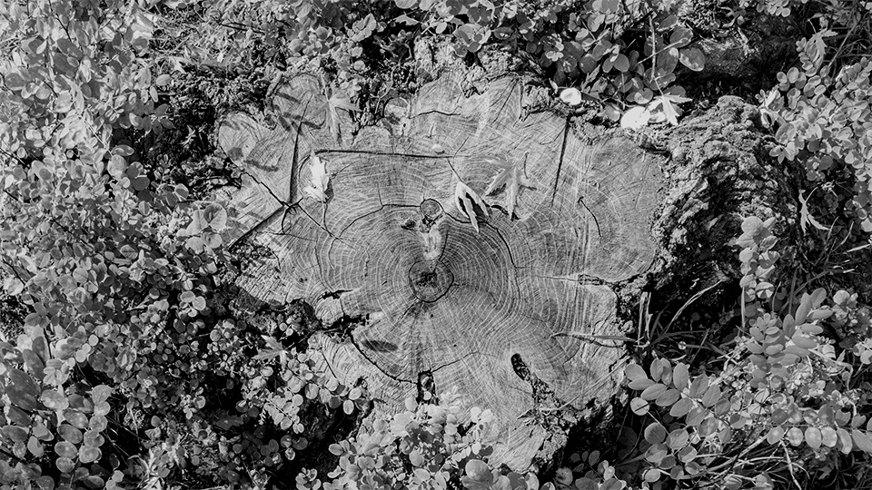

__Helligkeit: -10__  


__Helligkeit: Original__  


__Helligkeit: 10__  


__Helligkeit: 30__  


__Helligkeit: 50__  
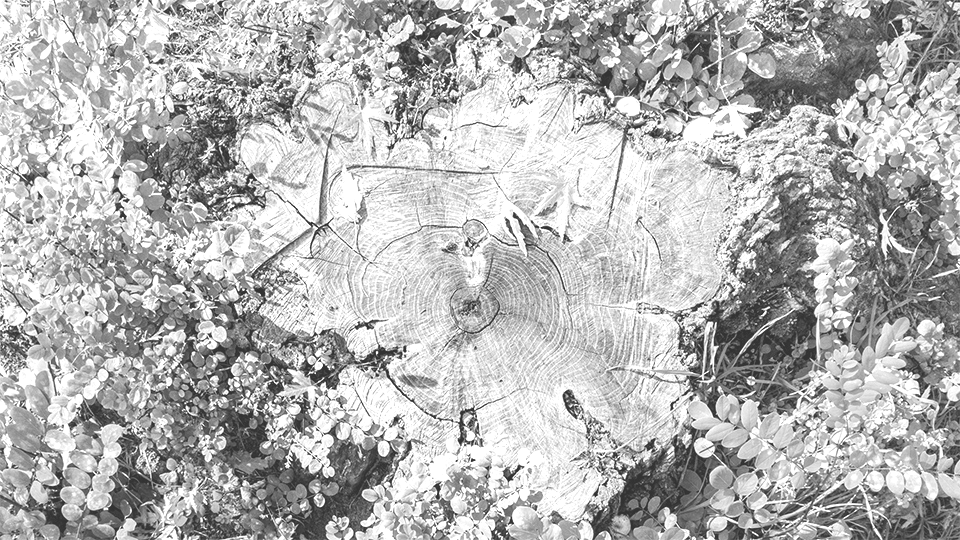

__Helligkeit: 70__  
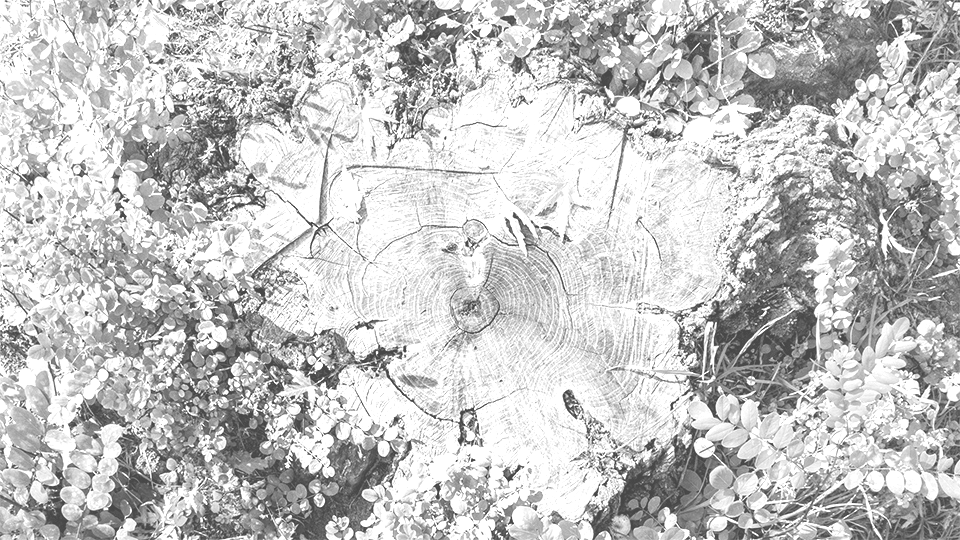

__Helligkeit: 90__  
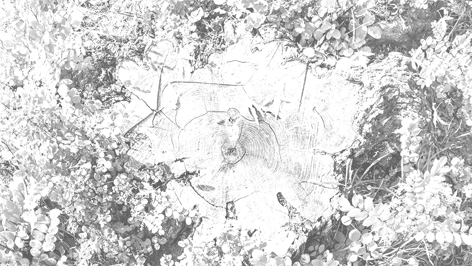

__Helligkeit: 110__  
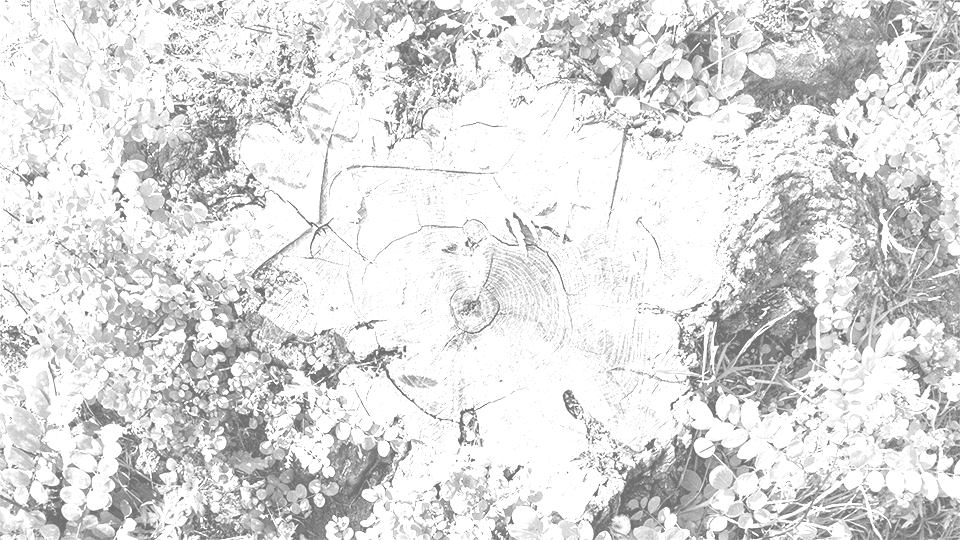

__Helligkeit: 130__  
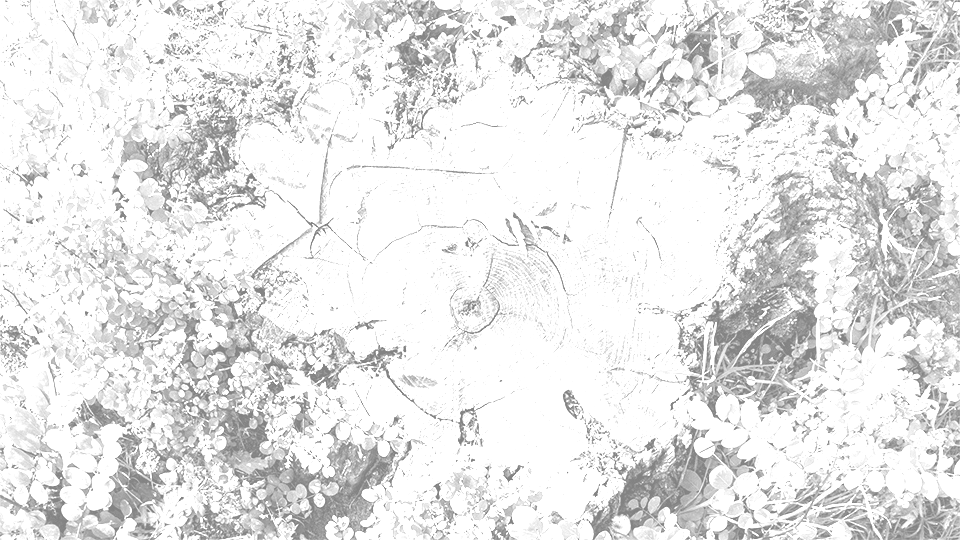

__Helligkeit: 150__  


__Helligkeit: 170__  
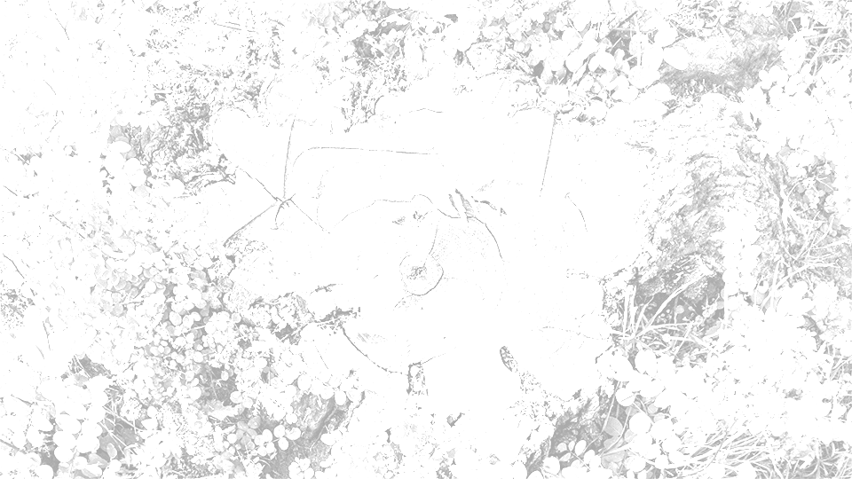

__Helligkeit: 190__  


__Helligkeit: 210__  


__Helligkeit: 230__  


__Helligkeit: 250__  
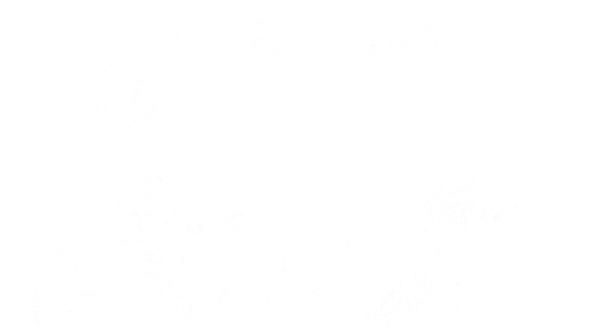

Das Motiv ist ab addiertem Helligkeitswert von -170 bis 70 noch gut zu erkennen, ohne dass viele Details verloren gehen.

__Histogramm des Bildes mit addiertem Helligkeitswert -170__  


<a href="assets/Aufgabe_4/textfiles/low_brightness.txt" title="Histogramm">
Histogramm als Text-Datei
</a>

__Histogramm des Bildes mit addiertem Helligkeitswert 70__  


<a href="assets/Aufgabe_4/textfiles/high_brightness.txt" title="Histogramm">
Histogramm als Text-Datei
</a>

Methode um die Helligkeit eines Pixels anzupassen
```java
    public static void setInRange(PixelColor p) {
        if (p.r < 0)
            p.r = 0;
        else if (p.r > 255)
            p.r = 255;

        if (p.g < 0)
            p.g = 0;
        else if (p.g > 255)
            p.g = 255;

        if (p.b < 0)
            p.b = 0;
        else if (p.b > 255)
            p.b = 255;
    }

    public static void adjustBrightness(PixelColor p, int bOffset) {
        p.r += bOffset;
        p.g += bOffset;
        p.b += bOffset;
        setInRange(p);
    }
```


## c) Kontrast


__Kontrast 0.2__  


__Kontrast 0.4__  


__Kontrast 0.8__  


__Kontrast 1.0__  


__Kontrast 1.5__  
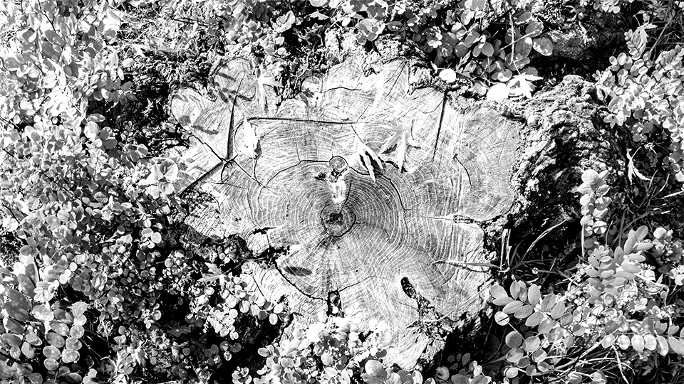

__Kontrast 2.5__  
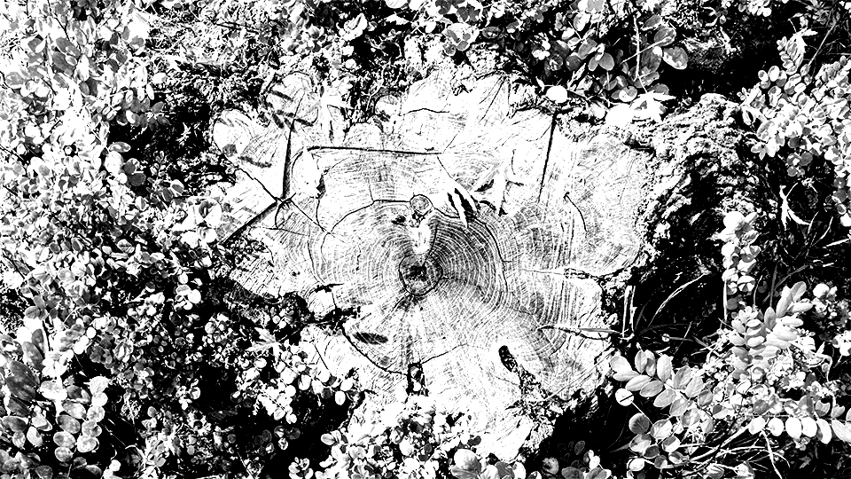

__Kontrast 5.0__  


__Kontrast 10.0__  


__Kontrast -1.0__  


Bei einem negativem Kontrast werden die Farben invertiert.

__Histogramm des Bildes mit stärksten Kontrast__  


<a href="assets/Aufgabe_4/textfiles/high_contrast.txt" title="Histogramm">
Histogramm als Text-Datei
</a>

__Histogramm des Bildes mit geringsten Kontrast__  
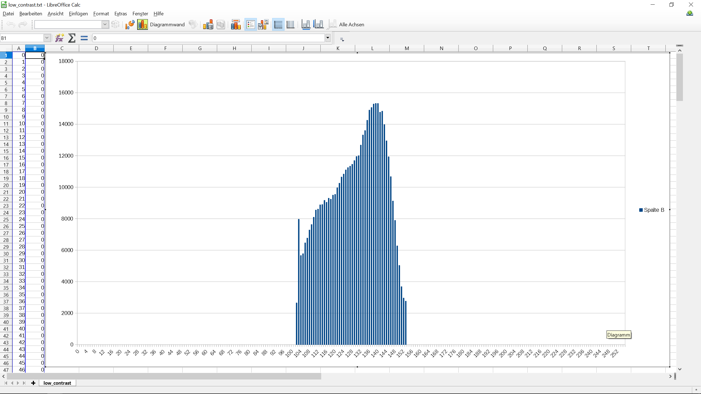

<a href="assets/Aufgabe_4/textfiles/low_contrast.txt" title="Histogramm">
Histogramm als Text-Datei
</a>

Bei einem Kontrast von 0 wird das Bild grau.

Eine Helligkeitsveränderung verschiebt die Werte bei einer positiven Änderung nach rechts. D.h. es treten vermehrt hellere Werte auf. Eine Veringerung der Helligkeit verschiebt die Werte nach links. Es treten also dunklere Werte häufiger auf.

Bei einer Kontrastanhebung werden hellere Werte heller gemacht und dunklere Werte dunkler. Die Ränder des Histogramms werden also verstärkt. Bei einer Verringerung des Kontrastes werden die Werte hingegen in die Mitte geschoben, da sehr dunkle und sehr helle Werte abgeschwächt werden.

<a href="assets/Aufgabe_4/bmp_io.java" title="Java-Quelltext">
Link zum Quelltext
</a>