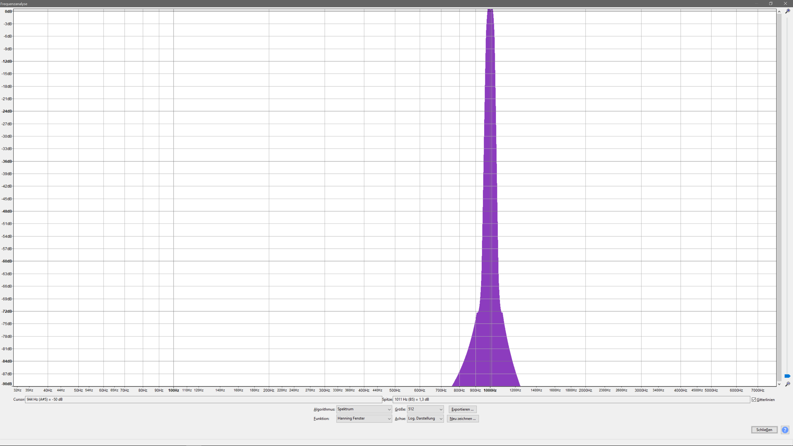

Übung 05
========

Aufgabe 1
---------

## a) 
__Musik-Original:__
<audio controls>
  <source src="assets/Aufgabe_5/sounds/music.wav" type="audio/wav">
</audio>

__Musik 3dB verstärkt__
<audio controls>
  <source src="assets/Aufgabe_5/sounds/amplify_3db.wav" type="audio/wav">
</audio>

__Musik 6dB verstärkt__
<audio controls>
  <source src="assets/Aufgabe_5/sounds/amplify_6db.wav" type="audio/wav">
</audio>

__Musik 9dB verstärkt__
<audio controls>
  <source src="assets/Aufgabe_5/sounds/amplify_9db.wav" type="audio/wav">
</audio>

Auszug aus dem Quelltext wie die Verstärkung durchgeführt wird:

```java
    public static void amplify(WavFile wav, double db) {
        double ampFac = Math.pow(10, db / 20d);
        for (int i = 0; i < wav.sound.length; i++) {
            int val = (int) Math.round(wav.sound[i] * ampFac);

            wav.sound[i] = range(val);
        }
    }

    public static short range(int val) {
        if (val > Short.MAX_VALUE) {
            val = Short.MAX_VALUE;
        } else if (val < Short.MIN_VALUE) {
            val = Short.MIN_VALUE;
        }
        return (short) val;
    }
```

## b)
Die Verzerrung ist bereits bei 3dB wahrnehmbar, jedoch nur an wenigen Stellen. Bei 6dB hingegen zerrt bereits fast jeder perkussive Ton.

## c)

Berechnung Klirrfaktor:  
Töne und Amplituden mit GRAM auslesen, dB auf Grundton normieren und in lineare Angaben zurückrechnen mit 10^(x/20) (x ist der normierte dB Wert). Dann Effektivwerte mit/ohne Grundton und schließlich Klirrfaktor k über Formel berechnen. Für Details s. [Excel Tabelle](assets/Aufgabe_5/Klirrfaktor.xlsx).

__Sinus-Original:__
<audio controls>
  <source src="assets/Aufgabe_5/sounds/music.wav" type="audio/wav">
</audio>

__Sinus 6dB verstärkt__
<audio controls>
  <source src="assets/Aufgabe_5/sounds/amplify_Sine_6db.wav" type="audio/wav">
</audio>
Klirrfaktor k = 0,569401

__Sinus 9dB verstärkt__
<audio controls>
  <source src="assets/Aufgabe_5/sounds/amplify_Sine_9db.wav" type="audio/wav">
</audio>
Klirrfaktor k = 0,574137

__Sinus 12dB verstärkt__
<audio controls>
  <source src="assets/Aufgabe_5/sounds/amplify_Sine_12db.wav" type="audio/wav">
</audio>
Klirrfaktor k = 0,606465


__Sinus Original Spektrum__  


__Sinus Original Signalverlauf / Clipping__  


__Sinus +6dB Spektrum__  


__Sinus +6dB Signalverlauf / Clipping__  


__Sinus +9dB Spektrum__  


__Sinus +9dB Signalverlauf / Clipping__  


__Sinus +12dB Spektrum__  


__Sinus +12dB Signalverlauf / Clipping__  


--------

Aufgabe 2
---------

## a)


__Musik 10ms verzögert__
<audio controls>
  <source src="assets/Aufgabe_5/sounds/echo_Music_10ms.wav" type="audio/wav">
</audio>

__Musik 100ms verzögert__
<audio controls>
  <source src="assets/Aufgabe_5/sounds/echo_Music_100ms.wav" type="audio/wav">
</audio>

__Musik 200ms verzögert__
<audio controls>
  <source src="assets/Aufgabe_5/sounds/echo_Music_200ms.wav" type="audio/wav">
</audio>

__Sprache 10ms verzögert__
<audio controls>
  <source src="assets/Aufgabe_5/sounds/echo_Voice_10ms.wav" type="audio/wav">
</audio>

__Sprache 100ms verzögert__
<audio controls>
  <source src="assets/Aufgabe_5/sounds/echo_Voice_100ms.wav" type="audio/wav">
</audio>

__Sprache 200ms verzögert__
<audio controls>
  <source src="assets/Aufgabe_5/sounds/echo_Voice_200ms.wav" type="audio/wav">
</audio>

Auszug aus dem Quelltext wie das Echo berechnet wird:

```java
    public static void echo(WavFile wav, int tDelta) {
        long sampleOffset = Math.round(wav.getSampleRate() * wav.getNumChannels() * (tDelta / 1000d));
        for (int i = 0; i < wav.sound.length; i += wav.getNumChannels()) {
            if (i < tDelta) {
                wav.sound[i] = wav.sound[i];
            } else {
                // iterate over channels
                for (int j = 0; j < wav.getNumChannels(); j++) {
                    int echoIndex = i + j - (int) sampleOffset;
                    if (echoIndex < 0 || i+j >= wav.sound.length) {
                        wav.sound[i] = wav.sound[i];
                    } else {
                        wav.sound[i + j] = range((int) (0.6 * wav.sound[echoIndex] + wav.sound[i + j]));
                    }
                }
            }
        }
    }
```

## b)
Die allgemeine Formel lautet: Samplerate * Anzahl der Kanäle * (Offset / 1000) = Offset des verzögerten Samples
Der Offset wird hier in ms angenommen, daher die Division durch 1000.
Ebenfalls wird angenommen, dass die Samples der Kanäle hintereinander abgespeichert werden.

Die Verzögerung bei 44,1 kHz und einem Mono Signal betrüge also:

10ms : 882 Samples

100ms : 8820 Samples

200ms : 17640 Samples


--------
Aufgabe 3
--------

## a) 

Filterimplementierung:

```java
    public static void filterOne(WavFile wav) {
        for (int i = 0; i < wav.sound.length; i++) {
            if (i == 0)
                wav.sound[i] = wav.sound[i];
            else
                wav.sound[i] = range((int)(0.5 * wav.sound[i] + 0.45 * wav.sound[i - 1]));
        }
    }

    public static void filterTwo(WavFile wav) {
        for (int i = 0; i < wav.sound.length; i++) {
            if (i == 0)
                wav.sound[i] = wav.sound[i];
            else
                wav.sound[i] = range((int)(0.5 * wav.sound[i] - 0.45 * wav.sound[i - 1]));
        }
    }
```

## b)
__weißes Rauschen Original:__
<audio controls>
  <source src="assets/Aufgabe_5/sounds/white_noise_ue5.wav" type="audio/wav">
</audio>

__weißes Rauschen Filter 1:__
<audio controls>
  <source src="assets/Aufgabe_5/sounds/filter_WhiteNoise_1.wav" type="audio/wav">
</audio>

__weißes Rauschen Filter 2:__
<audio controls>
  <source src="assets/Aufgabe_5/sounds/filter_WhiteNoise_2.wav" type="audio/wav">
</audio>

__Musik Filter 1:__
<audio controls>
  <source src="assets/Aufgabe_5/sounds/filter_Music_1.wav" type="audio/wav">
</audio>

__Musik Filter 2:__
<audio controls>
  <source src="assets/Aufgabe_5/sounds/filter_Music_2.wav" type="audio/wav">
</audio>

### Spektren

__Musik Original Spektrum__  


__Musik Filter 1 Spektrum__  


__Musik Filter 2 Spektrum__  


__Weißes Rauschen Original Spektrum__  


__Weißes Rauschen Filter 1 Spektrum__  


__Weißes Rauschen Filter 2 Spektrum__  


Bei den Filtern handelt es sich um Hochpass bzw. Tiefpassfilter. Filter 1 ist ein Tiefpass und Filter 2 ist ein Hochpass Filter. 

Ein Hochpassfilter dämpft niedrige Frequenzen, ein Tiefpassfilter dämpft hohe Frequenzen.

Dies ist im Frequenzspektrum des weißen Rauschens besonders gut erkennbar. 


<a href="assets/Aufgabe_5/wave_io.java" title="Java-Quelltext">
Link zum gesamten Quelltext
</a>