Übung 06
========

Aufgabe 1 Mittelwertfilter
---------
## a)

__Details Original__  

__Fläche Original__  
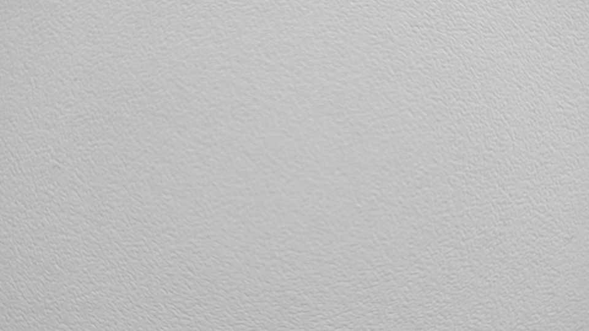

__Details Tiefpassfilter__  
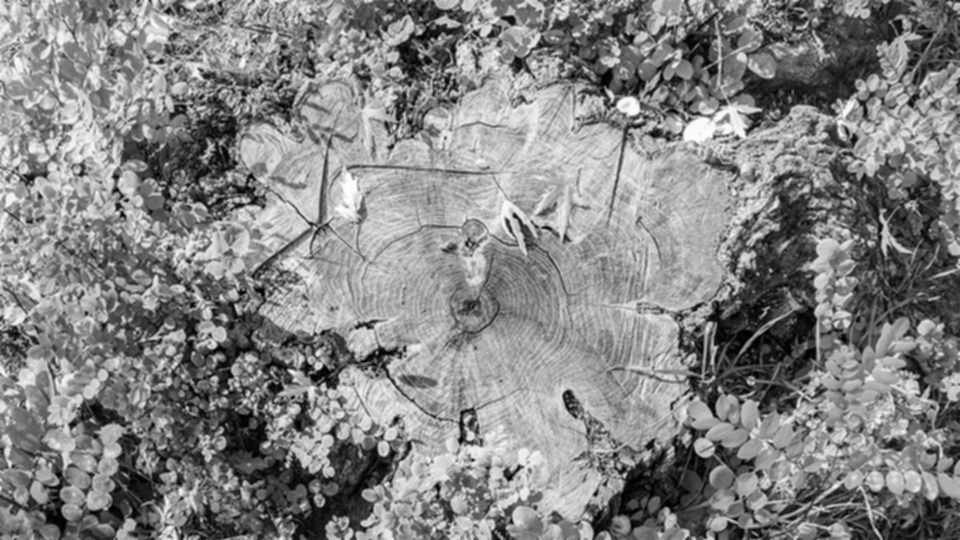

__Fläche Tiefpassfilter__  
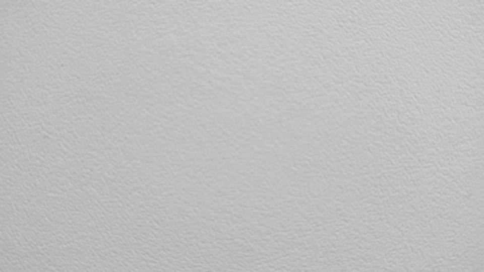

Der Tiefpassfilter zeichnet das Bild weich. Harte Kanten werden weicher dargestellt und Details auf dem Bild gehen verloren. 

Der Effekt beim Detailbild ist wesentlich stärker als beim Flächenbild.

## b)

Die Randpixel werden in diesem Fall auf das Pixel in der Mitte des Filters gesetzt, um eine einigermaßen korrekte Helligkeit der Randpixel zu gewährleisten.

## c)

__Details Tiefpassfilter Differenz__  
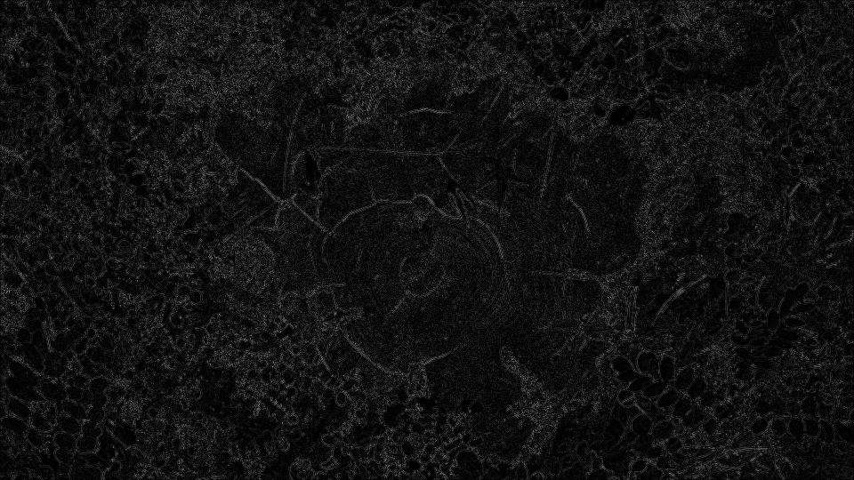

__Fläche Tiefpassfilter Differenz__  
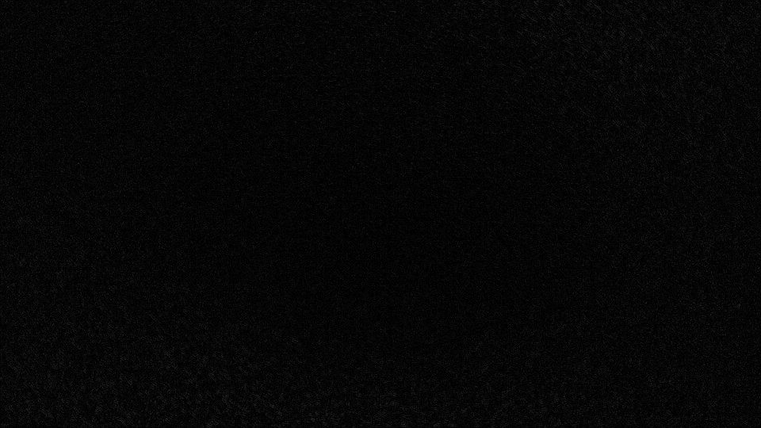

Der Kontrast des Differenzbildes für die Fläche wurde im Nachhinhein verstärkt.

Aufgabe 2 Gradientenfilter
---------
## a)

__Details Gradientenfilter__
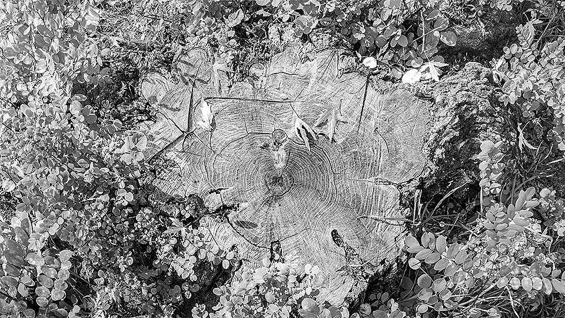

__Fläche Gradientenfilter__
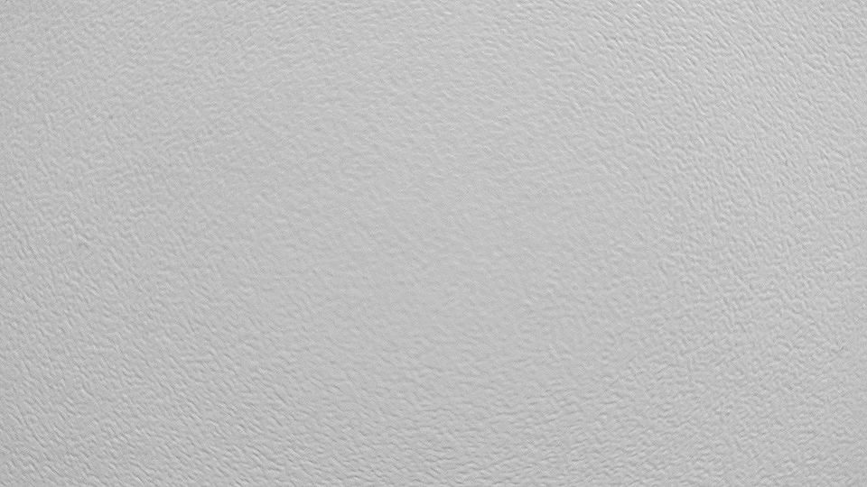

Um im Wertebereich von 0 bis 255 zu bleiben muss durch 4 geteilt werden.

Der Filter zeichnet das Bild scharf. Details werden verstärkt und harte Kanten hervorgehoben. Auch hier ist die Wirkung des Filters deutlicher auf dem Detailbild zu erkennen. 

## b)

__Details Gradientenfilter Differenz__
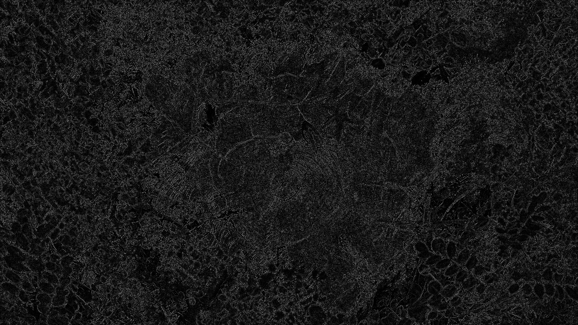

__Fläche Gradientenfilter Differenz__
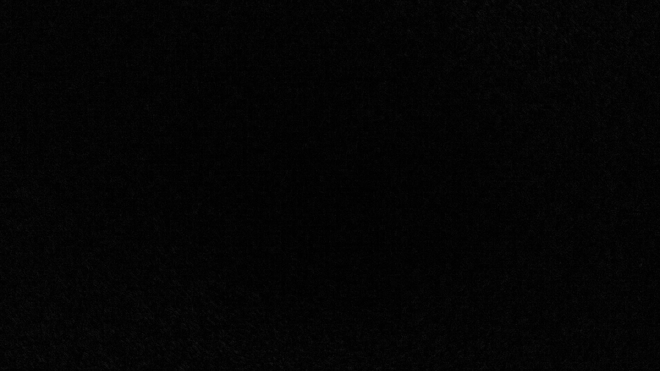

Der Kontrast des Differenzbildes für die Fläche wurde im Nachhinhein verstärkt.

Aufgabe 3 Medianfilter
---------
## a)

__Details mit Kratzern__

__Fläche mit Kratzern__
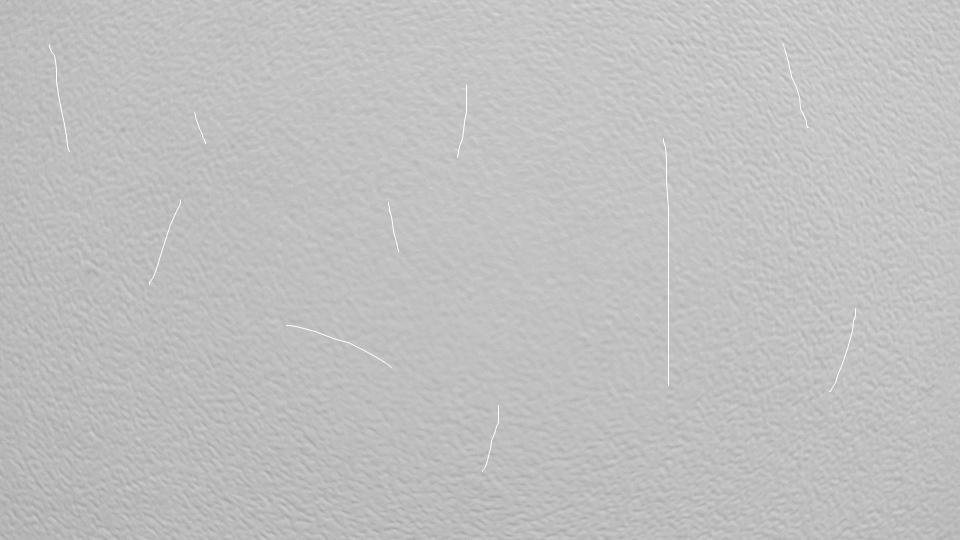

__Details Medianfilter__

__Fläche Medianfilter__
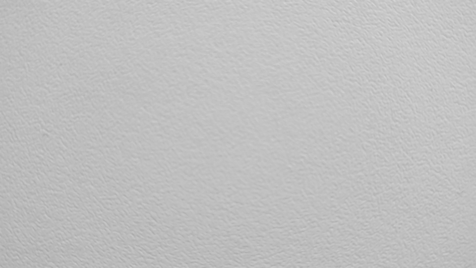

Aufgabe 4 Sobelfilter
---------
## a)

__Details Sobel X__
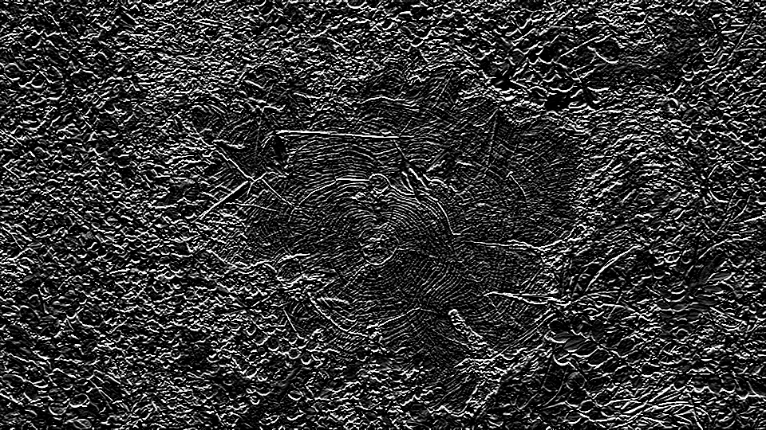

__Details Sobel Y__
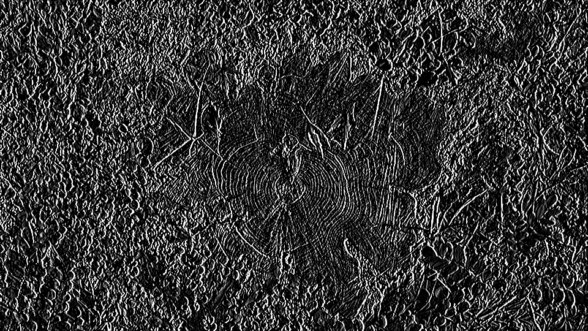

__Fläche Sobel X__
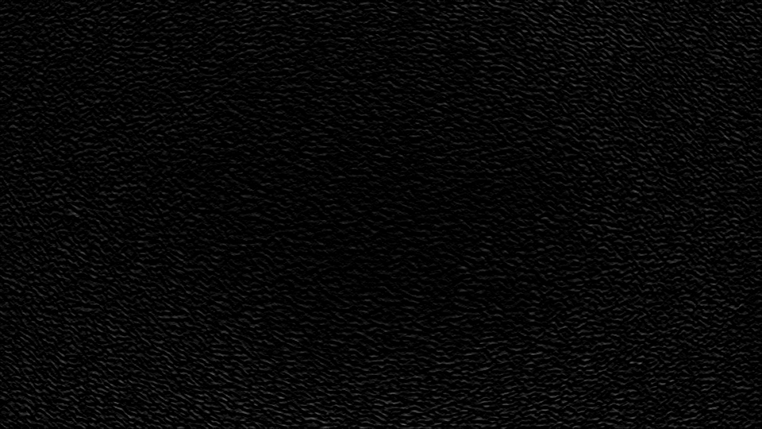

__Fläche Sobel Y__

<a href="assets/Aufgabe_6/bmp_io.java" title="Java-Quelltext">
Link zum gesamten Quelltext
</a>